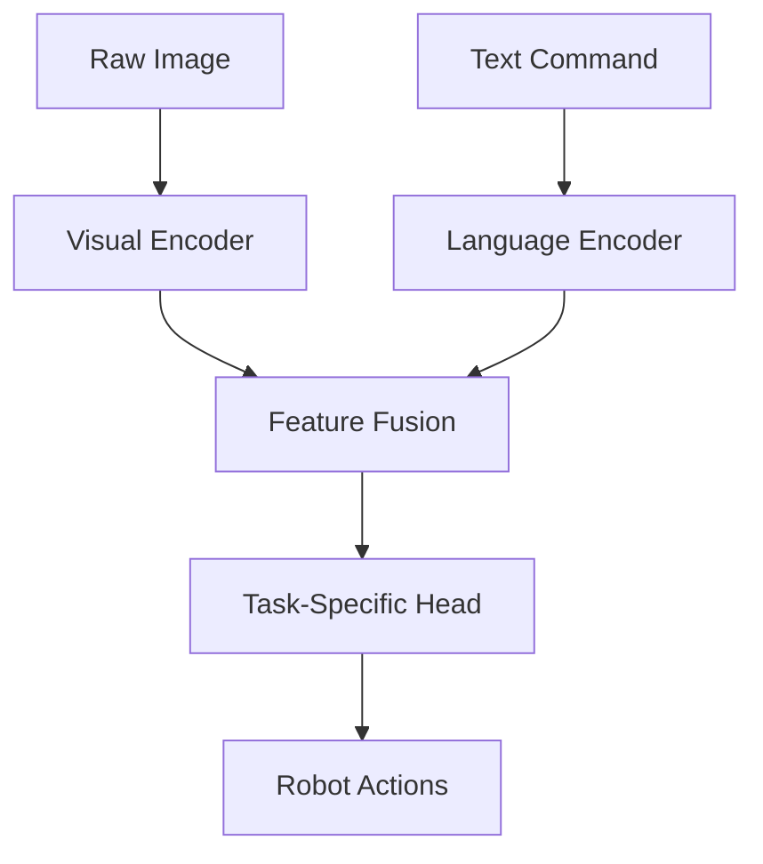

# Week 10-11: Vision-Language Integration and Foundation Models

In these two weeks, we'll explore how modern AI models integrate visual perception with language understanding to enable robots to interpret natural language commands and connect them to real-world visual observations. This represents a fundamental advance in embodied intelligence where language and vision are grounded in physical reality.

## Learning Objectives

By the end of these weeks, you will be able to:

- Understand the architecture of multimodal models that connect vision and language
- Implement vision-language models for robotic task understanding
- Fine-tune pre-trained models on robotic datasets
- Evaluate the performance of vision-language models in robotic contexts
- Connect vision-language models with action execution systems

## Introduction to Vision-Language Models

Vision-Language Models (VLMs) are neural networks that can process both visual and textual information simultaneously. In robotics, these models bridge the gap between high-level linguistic commands and low-level visual-motor control.

### Key Challenges in Vision-Language Integration

- **Grounded Language Understanding**: Connecting abstract language tokens to concrete visual features
- **Spatial Reasoning**: Understanding spatial relationships in natural language (e.g., "move to the left of the red cup")
- **Concept Grounding**: Learning to associate words with visual concepts in context
- **Task Generalization**: Applying learned models to novel combinations of objects and actions

## Architecture Overview

Vision-language systems typically follow a common architecture pattern that combines separate encoders for each modality:



This architecture allows the system to process information from both modalities in their native representations before combining them at an appropriate level of abstraction.

## Foundation Models for Robotics

Foundation models like CLIP, PaLI, and BLIP-2 have revolutionized computer vision and NLP by providing large pre-trained models that can be adapted to downstream tasks.

### Contrastive Language-Image Pre-training (CLIP)

CLIP trains an image encoder and a text encoder to map semantically similar images and text to nearby representations in a shared embedding space:

```python
import torch
import clip
from PIL import Image

# Example of using a pre-trained CLIP model
device = "cuda" if torch.cuda.is_available() else "cpu"
model, preprocess = clip.load("ViT-B/32", device=device)

# Load image and text
image = preprocess(Image.open("robot_scene.jpg")).unsqueeze(0).to(device)
text = clip.tokenize(["robot moving box", "robot grasping object", "robot standing still"]).to(device)

# Get similarities
with torch.no_grad():
    image_features = model.encode_image(image)
    text_features = model.encode_text(text)
    
    logits_per_image, logits_per_text = model(image, text)
    probs = logits_per_image.softmax(dim=-1).cpu().numpy()

print("Label probabilities:", probs)  # Prints: [[0.03, 0.95, 0.02]]
```

### Robotics-Specific Adaptations

While general VLMs provide strong foundational capabilities, robotics-specific adaptations are needed:

- **Temporal Integration**: Incorporating temporal sequences for action recognition and prediction
- **Embodied Learning**: Training on datasets that include robot interactions with the physical world
- **Fine-grained Recognition**: Understanding subtle differences that matter for task execution
- **3D Awareness**: Extending from 2D images to 3D understanding for manipulation

## Implementing Vision-Language Integration

Let's implement a vision-language system for robotic task understanding:

```python
import torch
import torch.nn as nn
import torchvision.transforms as T
from transformers import CLIPModel, CLIPProcessor
import numpy as np
from typing import List, Dict, Tuple

class VisionLanguageRobotModule(nn.Module):
    """
    A vision-language module for robotic task understanding.
    Combines visual perception with language processing for action planning.
    """
    def __init__(
        self,
        vision_encoder: nn.Module,
        language_encoder: nn.Module,
        fusion_dim: int = 512,
        action_space_dim: int = 7  # For 7-DOF robotic arm
    ):
        super().__init__()
        
        self.vision_encoder = vision_encoder
        self.language_encoder = language_encoder
        
        # Fusion layer to combine vision and language embeddings
        self.fusion_layer = nn.Sequential(
            nn.Linear(fusion_dim * 2, fusion_dim * 2),
            nn.ReLU(),
            nn.Linear(fusion_dim * 2, fusion_dim),
            nn.ReLU()
        )
        
        # Action prediction head
        self.action_head = nn.Sequential(
            nn.Linear(fusion_dim, fusion_dim // 2),
            nn.ReLU(),
            nn.Linear(fusion_dim // 2, action_space_dim)
        )
        
        # Task prediction head
        self.task_head = nn.Sequential(
            nn.Linear(fusion_dim, fusion_dim // 2),
            nn.ReLU(),
            nn.Linear(fusion_dim // 2, 100)  # Assuming 100 possible tasks
        )

    def forward(self, images: torch.Tensor, texts: List[str]) -> Tuple[torch.Tensor, torch.Tensor]:
        """
        Forward pass through the vision-language module.
        
        Args:
            images: Batch of images (B, C, H, W)
            texts: List of text prompts (B,)
        
        Returns:
            action_predictions: Predicted actions (B, action_space_dim)
            task_predictions: Task classification scores (B, num_tasks)
        """
        # Encode visual information
        visual_features = self.vision_encoder(images)
        
        # Encode textual information (simplified, in practice use tokenizer and text encoder)
        text_features = self.encode_texts(texts)
        
        # Fuse vision and language representations
        fused_features = self.fusion_layer(
            torch.cat([visual_features, text_features], dim=1)
        )
        
        # Predict actions and tasks
        action_predictions = self.action_head(fused_features)
        task_predictions = self.task_head(fused_features)
        
        return action_predictions, task_predictions

    def encode_texts(self, texts: List[str]) -> torch.Tensor:
        """
        Simplified text encoding. In practice, this would use a pre-trained language model.
        """
        # Placeholder implementation - in practice, use a transformer-based encoder
        # and tokenize the input texts
        batch_size = len(texts)
        # Return dummy features (in practice, encode texts using RoBERTa, BERT, etc.)
        return torch.randn(batch_size, self.fusion_dim).to(next(self.parameters()).device)

# Example usage
def create_robot_vlm() -> VisionLanguageRobotModule:
    """
    Create a vision-language model for robotic applications.
    In practice, this would use pre-trained components from models like CLIP or PaLI.
    """
    # In practice, use pre-trained encoders
    vision_encoder = nn.Conv2d(3, 512, kernel_size=3, stride=2, padding=1)  # Simplified
    language_encoder = nn.Embedding(10000, 512)  # Simplified
    
    return VisionLanguageRobotModule(
        vision_encoder=vision_encoder,
        language_encoder=language_encoder,
        fusion_dim=512
    )

# Usage example
robot_vlm = create_robot_vlm()
dummy_images = torch.randn(4, 3, 224, 224)  # Batch of 4 images
dummy_texts = [
    "move the red block to the left",
    "pick up the pencil",
    "rotate the object 90 degrees",
    "move forward and grasp"
]

actions, tasks = robot_vlm(dummy_images, dummy_texts)
print(f"Action predictions shape: {actions.shape}")
print(f"Task predictions shape: {tasks.shape}")
```

## Multimodal Fusion Techniques

Effective vision-language integration requires sophisticated fusion techniques:

### Early Fusion
Combining modalities at the input level by concatenating features early in the network:

```python
class EarlyFusionModule(nn.Module):
    """
    Example of early fusion for vision-language integration.
    Concatenates visual and textual features early in the processing pipeline.
    """
    def __init__(self, vis_dim: int, lang_dim: int, output_dim: int):
        super().__init__()
        self.projection = nn.Linear(vis_dim + lang_dim, output_dim)
        self.norm = nn.LayerNorm(output_dim)
        self.activation = nn.ReLU()
        
    def forward(self, vision_features: torch.Tensor, 
                language_features: torch.Tensor) -> torch.Tensor:
        # Concatenate vision and language features
        concatenated = torch.cat([vision_features, language_features], dim=-1)
        
        # Project to output dimension
        fused = self.projection(concatenated)
        
        # Apply normalization and activation
        return self.activation(self.norm(fused))
```

### Late Fusion
Processing modalities independently before combining at a later stage:

```python
class LateFusionModule(nn.Module):
    """
    Example of late fusion for vision-language integration.
    Processes modalities independently before fusing.
    """
    def __init__(self, common_dim: int):
        super().__init__()
        self.vis_projection = nn.Linear(512, common_dim)  # Vision to common space
        self.lang_projection = nn.Linear(512, common_dim)  # Language to common space
        self.fusion_gate = nn.Linear(common_dim * 2, 1)
        
    def forward(self, vision_features: torch.Tensor, 
                language_features: torch.Tensor) -> torch.Tensor:
        # Project both modalities to common space
        projected_vis = self.vis_projection(vision_features)
        projected_lang = self.lang_projection(language_features)
        
        # Learnable weighted combination
        combined = torch.cat([projected_vis, projected_lang], dim=-1)
        gate_weights = torch.sigmoid(self.fusion_gate(combined))
        
        # Weighted sum
        return gate_weights * projected_vis + (1 - gate_weights) * projected_lang
```

### Cross-Attention Fusion
Using attention mechanisms to allow each modality to attend to relevant parts of the other:

```python
class CrossAttentionFusion(nn.Module):
    """
    Cross-attention fusion for vision-language integration.
    Allows each modality to attend to relevant parts of the other.
    """
    def __init__(self, hidden_dim: int, num_heads: int = 8):
        super().__init__()
        self.hidden_dim = hidden_dim
        self.num_heads = num_heads
        self.head_dim = hidden_dim // num_heads
        
        # Projections for vision and language
        self.vis_q = nn.Linear(hidden_dim, hidden_dim)
        self.vis_k = nn.Linear(hidden_dim, hidden_dim)
        self.vis_v = nn.Linear(hidden_dim, hidden_dim)
        
        self.lang_q = nn.Linear(hidden_dim, hidden_dim)
        self.lang_k = nn.Linear(hidden_dim, hidden_dim)
        self.lang_v = nn.Linear(hidden_dim, hidden_dim)
        
        self.out_proj = nn.Linear(hidden_dim, hidden_dim)
        
    def forward(self, vision_features: torch.Tensor, 
                language_features: torch.Tensor) -> Tuple[torch.Tensor, torch.Tensor]:
        # Cross-attention: vision attending to language
        lang_q = self.lang_q(language_features)
        vis_k = self.vis_k(vision_features)
        vis_v = self.vis_v(vision_features)
        
        # Compute attention weights
        attn_weights_v2l = torch.softmax(
            torch.matmul(lang_q, vis_k.transpose(-2, -1)) / (self.head_dim ** 0.5),
            dim=-1
        )
        
        # Apply attention
        attended_language = torch.matmul(attn_weights_v2l, vis_v)
        
        # Cross-attention: language attending to vision
        vis_q = self.vis_q(vision_features)
        lang_k = self.lang_k(language_features)
        lang_v = self.lang_v(language_features)
        
        attn_weights_l2v = torch.softmax(
            torch.matmul(vis_q, lang_k.transpose(-2, -1)) / (self.head_dim ** 0.5),
            dim=-1
        )
        
        attended_vision = torch.matmul(attn_weights_l2v, lang_v)
        
        # Output projections
        fused_vision = self.out_proj(attended_vision)
        fused_language = self.out_proj(attended_language)
        
        return fused_vision, fused_language
```

## Vision-Language Datasets for Robotics

Training effective vision-language models for robotics requires appropriate datasets:

- **ALOHA Dataset**: Large-scale dataset of robot manipulation demonstrations with language descriptions
- **Bridge Data**: Dataset of robot tasks performed by human operators with language annotations
- **Robotics Transformer 2 (RT-2) Dataset**: Web-scale pre-training data combined with robotic experience
- **OXE (Open X-Embodiment)**: Collection of diverse robotic datasets for cross-embodiment learning

## Transfer Learning with Pre-trained Models

A common approach is to adapt pre-trained vision-language models to robotics:

```python
import torch
import torch.nn as nn
from transformers import CLIPModel, CLIPProcessor
from peft import get_peft_model, LoraConfig  # Parameter-efficient fine-tuning

class FineTunedRobotVLM(nn.Module):
    """
    A robot-specific vision-language model adapted from a pre-trained foundation model.
    Uses parameter-efficient fine-tuning to adapt to robotic tasks.
    """
    def __init__(self, base_model_name: str = "openai/clip-vit-base-patch32"):
        super().__init__()
        
        # Load pre-trained model
        self.base_model = CLIPModel.from_pretrained(base_model_name)
        
        # Freeze base model weights (optional - depends on training strategy)
        for param in self.base_model.parameters():
            param.requires_grad = False
            
        # Add robotic-specific components
        self.robot_task_head = nn.Sequential(
            nn.Linear(self.base_model.config.projection_dim, 256),
            nn.ReLU(),
            nn.Linear(256, 10)  # 10 robotic tasks as example
        )
        
        # Action prediction head
        self.action_predictor = nn.Sequential(
            nn.Linear(self.base_model.config.projection_dim, 512),
            nn.ReLU(),
            nn.Linear(512, 7)  # 7-DOF robot arm actions
        )

    def forward(self, images: torch.Tensor, texts: torch.Tensor):
        """
        Forward pass with pre-trained encoder and robot-specific heads.
        """
        # Get encodings from frozen pre-trained model
        outputs = self.base_model(pixel_values=images, input_ids=texts)
        
        # Extract joint vision-language embedding
        joint_embedding = outputs.logits_per_image  # Shape: (batch_size, batch_size)
        
        # Predict robot-specific outputs
        task_logits = self.robot_task_head(joint_embedding)
        action_pred = self.action_predictor(joint_embedding)
        
        return task_logits, action_pred

# Example usage
robot_model = FineTunedRobotVLM()
# Further training would involve robot-specific datasets
```

## Practical Applications

Vision-language integration enables several key capabilities in robotics:

- **Command Following**: Interpreting natural language commands to navigate or manipulate
- **Semantic Scene Understanding**: Identifying and reasoning about objects and their affordances
- **Task Generalization**: Applying learned concepts to novel combinations of objects and verbs
- **Interactive Learning**: Correcting robot behavior through natural language feedback

## Lab Exercise Preview

In the next section, you'll find detailed instructions for implementing a vision-language model for a specific robotic task, including data preparation, model fine-tuning, and evaluation metrics.

## Summary

In these weeks, you've learned:

- How vision-language models connect abstract language to concrete visual perception
- Different fusion techniques for combining vision and language modalities
- How to adapt pre-trained foundation models for robotic applications
- Practical applications of vision-language integration in robotics

## Navigation

[← Previous: NVIDIA Isaac Module](../nvidia-isaac/intro.md) | [Next: Week 12 →](./week12.md) | [Module Home →](./intro.md)