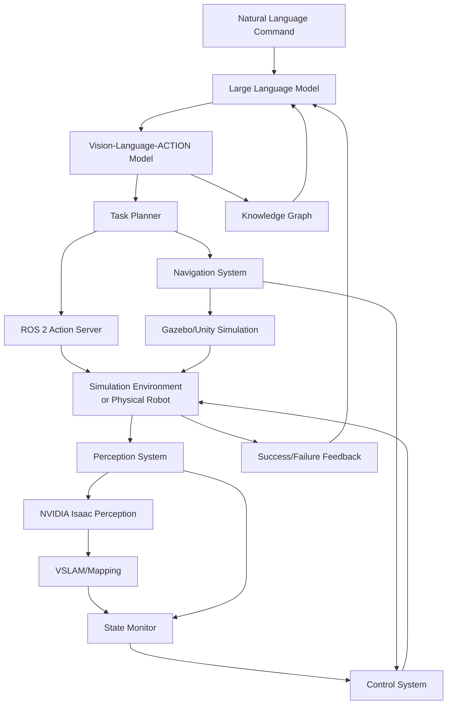

# Week 13: Course Synthesis and Capstone Project

In this final week of the Physical AI & Humanoid Robotics course, you'll synthesize everything you've learned across all modules to implement a comprehensive AI-powered robotic system. This capstone project will integrate ROS 2, simulation environments, AI perception and reasoning, and vision-language-action capabilities into a complete embodied AI system.

## Learning Objectives

By the end of this week, you will be able to:

- Integrate all components learned throughout the course into a unified system
- Design and implement a complete AI-robot system with perception, planning, and control
- Deploy a vision-language-action pipeline on a physical or simulated robot platform
- Evaluate the performance of your integrated system against specific benchmarks
- Document and present your project as a complete system

## Capstone Project: Autonomous Task Execution with Natural Language Interaction

For your capstone project, you'll build a complete system that demonstrates the integration of all course modules:

### Project Requirements

Your system must:

1. **Accept Natural Language Commands**: Process high-level tasks expressed in natural language
2. **Perceive the Environment**: Use vision and other sensors to understand the current state
3. **Plan Actions**: Generate a sequence of actions to accomplish the requested task
4. **Execute Actions**: Control the robot to perform the planned actions in simulation or on a physical platform
5. **Handle Unexpected Situations**: Adapt to changes in the environment or initial plan failures

### Example Project Scenarios

Choose one of the following scenarios or propose your own with instructor approval:

1. **Warehouse Assistant**: Robot that understands commands like "Retrieve the red box from shelf A and place it in the blue container" in a simulated warehouse environment
2. **Social Robot Helper**: Robot that assists with household tasks like "Bring me the water bottle from the kitchen table"
3. **Laboratory Assistant**: Robot that performs scientific tasks like "Move sample A from rack 1 to microscope, acquire image, and store in folder 'analysis'"
4. **Educational Tutor**: Robot that demonstrates simple physics concepts based on verbal descriptions

## System Architecture

Your system will integrate components from all previous modules:



### Component Integration

Your system should demonstrate integration across:

1. **Module 1 (ROS 2)**: All communication between system components should use ROS 2 topics, services, and actions
2. **Module 2 (Gazebo/Unity)**: Use simulation for testing and development, with sim-to-real transfer
3. **Module 3 (NVIDIA Isaac)**: Implement perception systems using Isaac's AI capabilities
4. **Module 4 (VLA)**: Process natural language commands and generate appropriate actions

## Implementation Steps

### Step 1: System Design (Day 1)

Create a design document for your project that includes:

- System architecture diagram showing component interactions
- ROS 2 node topology with message topics and services
- Data flow from language input to action execution
- Error handling and fallback strategies
- Component interfaces and responsibilities

### Step 2: Environment Setup (Day 1)

Set up the integrated environment:

```bash
# Set up workspace for the integrated system
mkdir -p ~/capstone_ws/src
cd ~/capstone_ws/src

# Clone necessary packages
git clone https://github.com/ros-planning/navigation2.git
git clone https://github.com/protocolbuffers/paligemma-description.git  # For vision-language models

# Build the workspace
cd ~/capstone_ws
colcon build --symlink-install
source install/setup.bash
```

### Step 3: Language-to-Action Pipeline (Days 1-2)

Implement the language understanding and action planning component:

```python
# capstone_project/capstone_project/language_action_node.py
import rclpy
from rclpy.node import Node
from std_msgs.msg import String
from geometry_msgs.msg import PoseStamped
from move_base_msgs.msg import MoveBaseAction, MoveBaseGoal
from sensor_msgs.msg import Image
import openai
import yaml
import json
from typing import Dict, List, Any


class CapstoneLanguageActionNode(Node):
    """
    Capstone integration node that connects language understanding to robot action.
    Integrates all course modules: ROS 2, Gazebo/Unity, NVIDIA Isaac, and VLA.
    """
    
    def __init__(self):
        super().__init__('capstone_integration_node')
        
        # Initialize components from all modules
        self.initialize_ros_components()
        self.initialize_perception_system()
        self.initialize_language_model()
        self.initialize_navigation_system()
        
        # Set up communication
        self.command_subscriber = self.create_subscription(
            String,
            '/natural_language_command',
            self.command_callback,
            10
        )
        
        self.status_publisher = self.create_publisher(
            String,
            '/system_status',
            10
        )
        
        self.get_logger().info("Capstone Integration Node Initialized")
    
    def initialize_ros_components(self):
        """Initialize ROS 2 communication components from Module 1"""
        self.get_logger().info("Initializing ROS 2 components...")
        # Initialize action clients, services, and publishers for robot control
        # This would include navigation goals, manipulation actions, etc.
        
    def initialize_perception_system(self):
        """Initialize perception using NVIDIA Isaac (Module 3)"""
        self.get_logger().info("Initializing perception system...")
        # Initialize object detection, SLAM, and other Isaac-based perception
        # components for environmental understanding
        
    def initialize_language_model(self):
        """Initialize VLA model for command interpretation (Module 4)"""
        self.get_logger().info("Initializing language model...")
        # Initialize your chosen VLA model (either use a pre-trained one 
        # or a simple rule-based system for demonstration)
        
    def initialize_navigation_system(self):
        """Initialize navigation in simulation environment (Module 2)"""
        self.get_logger().info("Initializing navigation system...")
        # Set up navigation stack for movement in the environment
        
    def command_callback(self, msg):
        """Process natural language command and execute robotic task"""
        command = msg.data
        self.get_logger().info(f"Received command: '{command}'")
        
        try:
            # Step 1: Use LLM to interpret the command
            action_plan = self.interpret_command(command)
            
            # Step 2: Check if task is feasible with current perception
            if not self.validate_plan_against_perception(action_plan):
                self.publish_error("Task not feasible with current environment state")
                return
            
            # Step 3: Execute the action plan
            success = self.execute_action_plan(action_plan)
            
            # Step 4: Report outcome
            if success:
                self.publish_success(f"Task completed: {command}")
            else:
                self.publish_error(f"Task failed: {command}")
                
        except Exception as e:
            self.get_logger().error(f"Error processing command: {e}")
            self.publish_error(f"Error processing command: {str(e)}")
    
    def interpret_command(self, command: str) -> List[Dict[str, Any]]:
        """
        Interpret natural language command using VLA model.
        
        Args:
            command: Natural language command from user
            
        Returns:
            List of actions to execute
        """
        # This would typically use a VLA model to interpret the command
        # For this example, we'll use a simple rule-based interpreter
        # that demonstrates the concept
        
        command_lower = command.lower()
        
        actions = []
        
        if "go to" in command_lower or "move to" in command_lower:
            # Extract location information
            if "kitchen" in command_lower:
                actions.append({
                    "action": "navigate_to",
                    "target_location": "kitchen_waypoint"
                })
            elif "table" in command_lower:
                actions.append({
                    "action": "navigate_to", 
                    "target_location": "table_waypoint"
                })
                
        if "pick up" in command_lower or "grasp" in command_lower:
            # Extract object information
            if "water bottle" in command_lower:
                actions.append({
                    "action": "pick_object",
                    "object_name": "water_bottle"
                })
                
        if "place" in command_lower or "put" in command_lower:
            actions.append({
                "action": "place_object",
                "object_name": "water_bottle",
                "target_location": "counter"
            })
            
        return actions
    
    def validate_plan_against_perception(self, action_plan: List[Dict[str, Any]]) -> bool:
        """
        Check if the action plan is feasible with current environmental state.
        
        Args:
            action_plan: Planned actions to execute
            
        Returns:
            True if plan is feasible, False otherwise
        """
        # Use perception system to validate plan feasibility
        # This is where Isaac perception comes into play
        self.get_logger().info("Validating plan against current perception...")
        
        # For simplicity, just return True in this example
        # In practice, check if objects are where expected, etc.
        return True
    
    def execute_action_plan(self, action_plan: List[Dict[str, Any]]) -> bool:
        """
        Execute a sequence of planned actions.
        
        Args:
            action_plan: List of actions to execute
            
        Returns:
            True if all actions completed successfully, False otherwise
        """
        for i, action in enumerate(action_plan):
            self.get_logger().info(f"Executing action {i+1}/{len(action_plan)}: {action}")
            
            success = self.execute_single_action(action)
            
            if not success:
                self.get_logger().error(f"Action failed: {action}")
                return False
                
        return True
    
    def execute_single_action(self, action: Dict[str, Any]) -> bool:
        """Execute a single robot action."""
        action_type = action.get("action", "")
        
        if action_type == "navigate_to":
            return self.execute_navigation(action)
        elif action_type == "pick_object":
            return self.execute_manipulation_pick(action)
        elif action_type == "place_object":
            return self.execute_manipulation_place(action)
        else:
            self.get_logger().error(f"Unknown action type: {action_type}")
            return False
    
    def execute_navigation(self, action: Dict[str, Any]) -> bool:
        """Execute navigation action using Gazebo/Unity simulation."""
        target_location = action.get("target_location", "")
        
        self.get_logger().info(f"Navigating to: {target_location}")
        
        # In a real implementation, this would send navigation goals
        # and monitor execution progress
        # For simulation, we'd use navigation2 stack
        
        # Simulate navigation completion
        import time
        time.sleep(2)  # Simulate navigation time
        
        self.get_logger().info("Navigation completed")
        return True
    
    def execute_manipulation_pick(self, action: Dict[str, Any]) -> bool:
        """Execute pick action using Isaac perception and control."""
        object_name = action.get("object_name", "")
        
        self.get_logger().info(f"Picking up: {object_name}")
        
        # In a real implementation, this would use perception to locate
        # the object and plan a grasping motion
        # Use Isaac perception to identify object location
        
        # Simulate pick completion
        import time
        time.sleep(3)  # Simulate pick action time
        
        self.get_logger().info("Pick completed")
        return True
    
    def execute_manipulation_place(self, action: Dict[str, Any]) -> bool:
        """Execute place action using Isaac perception and control."""
        object_name = action.get("object_name", "")
        location = action.get("target_location", "")
        
        self.get_logger().info(f"Placing: {object_name} at {location}")
        
        # In a real implementation, this would use perception to locate
        # the placement target and plan a placing motion
        
        # Simulate place completion
        import time
        time.sleep(2)  # Simulate place action time
        
        self.get_logger().info("Place completed")
        return True
    
    def publish_success(self, message: str):
        """Publish success message."""
        status_msg = String()
        status_msg.data = f"SUCCESS: {message}"
        self.status_publisher.publish(status_msg)
    
    def publish_error(self, message: str):
        """Publish error message."""
        status_msg = String()
        status_msg.data = f"ERROR: {message}"
        self.status_publisher.publish(status_msg)


def main(args=None):
    rclpy.init(args=args)
    
    capstone_node = CapstoneLanguageActionNode()
    
    try:
        rclpy.spin(capstone_node)
    except KeyboardInterrupt:
        capstone_node.get_logger().info("Shutting down capstone integration node...")
    finally:
        capstone_node.destroy_node()
        rclpy.shutdown()


if __name__ == '__main__':
    main()
```

### Step 4: Project Launch File

Create a launch file to bring up your integrated system:

```xml
<!-- capstone_project/launch/capstone_system.launch.py -->
from launch import LaunchDescription
from launch_ros.actions import Node
from launch.actions import DeclareLaunchArgument
from launch.substitutions import LaunchConfiguration
from ament_index_python.packages import get_package_share_directory
import os


def generate_launch_description():
    # Declare launch arguments
    use_sim_time = LaunchConfiguration('use_sim_time', default='true')
    
    # Capstone integration node
    capstone_integration_node = Node(
        package='capstone_project',
        executable='capstone_integration_node',
        name='capstone_integration_node',
        parameters=[
            {'use_sim_time': use_sim_time}
        ],
        remappings=[
            ('/natural_language_command', '/user_commands'),
            ('/system_status', '/capstone/status')
        ],
        output='screen'
    )
    
    # Perception node using Isaac packages
    perception_node = Node(
        package='isaac_ros_pointcloud_utils',
        executable='pointcloud_to_laserscan_node',
        name='perception_node',
        parameters=[
            {'use_sim_time': use_sim_time},
            {'min_height': 0.1},
            {'max_height': 2.0},
            {'scan_height': 1.0}
        ]
    )
    
    # Navigation node
    navigation_node = Node(
        package='nav2_planner',
        executable='nav2_planner',
        name='nav2_planner_server',
        parameters=[
            {'use_sim_time': use_sim_time}
        ]
    )
    
    return LaunchDescription([
        capstone_integration_node,
        perception_node,
        navigation_node
    ])
```

### Step 5: Testing and Evaluation (Days 3-4)

Develop tests for your integrated system:

1. **Unit Tests**: Test individual components in isolation
2. **Integration Tests**: Test how components work together
3. **System Tests**: Test end-to-end functionality
4. **Performance Tests**: Measure execution time, success rate, etc.

```python
# capstone_project/test/test_capstone_integration.py
import unittest
import rclpy
from rclpy.node import Node
from std_msgs.msg import String
from capstone_project.language_action_node import CapstoneLanguageActionNode
import time


class TestCapstoneIntegration(unittest.TestCase):
    
    def setUp(self):
        rclpy.init()
        self.node = CapstoneLanguageActionNode()
        
    def tearDown(self):
        self.node.destroy_node()
        rclpy.shutdown()
    
    def test_command_interpretation(self):
        """Test that natural language commands are correctly interpreted."""
        command = "Go to the kitchen and pick up the water bottle"
        action_plan = self.node.interpret_command(command)
        
        # Check that navigation and manipulation actions are generated
        navigation_actions = [a for a in action_plan if a.get("action") == "navigate_to"]
        manipulation_actions = [a for a in action_plan if "object" in str(a)]
        
        self.assertTrue(len(navigation_actions) > 0, "Should generate navigation actions")
        self.assertTrue(len(manipulation_actions) > 0, "Should generate manipulation actions")
    
    def test_action_execution_simulation(self):
        """Test that actions can be executed in simulation."""
        # Create a simple action plan
        action_plan = [
            {"action": "navigate_to", "target_location": "test_location"}
        ]
        
        # Execute the plan (in simulation, this should complete without errors)
        success = self.node.execute_action_plan(action_plan)
        
        self.assertTrue(success, "Action plan should execute successfully in simulation")


def test_suite():
    """Create a test suite for the capstone project."""
    suite = unittest.TestSuite()
    
    # Add tests to suite
    suite.addTest(TestCapstoneIntegration('test_command_interpretation'))
    suite.addTest(TestCapstoneIntegration('test_action_execution_simulation'))
    
    return suite


if __name__ == '__main__':
    runner = unittest.TextTestRunner(verbosity=2)
    runner.run(test_suite())
```

## Evaluation Criteria

Your capstone project will be evaluated on:

### Technical Implementation (40 points)
- **Module Integration (20 points)**: Proper integration of components from all 4 modules
- **Functionality (20 points)**: System performs as expected for the chosen scenario

### System Design (25 points)
- **Architecture (10 points)**: Well-designed system architecture with clear component separation
- **Documentation (10 points)**: Clear documentation explaining design decisions and implementation
- **Code Quality (5 points)**: Clean, well-commented, and maintainable code

### Performance (20 points)
- **Task Success Rate (10 points)**: Percentage of tasks completed successfully
- **Efficiency (10 points)**: Execution time and resource utilization efficiency

### Innovation and Creativity (15 points)
- **Originality (8 points)**: Creative approach to solving the problem
- **Advanced Features (7 points)**: Implementation of advanced features beyond basic requirements

## Presentation Requirements

Prepare a 10-minute presentation that covers:

1. **Problem Statement** (1 minute)
   - What task does your system perform?
   - Why is it challenging?

2. **System Design** (3 minutes)
   - Architecture diagram showing module integration
   - Key components and their roles
   - How components communicate

3. **Implementation** (3 minutes)
   - Key technical challenges overcome
   - Code snippets demonstrating critical functionality
   - Demonstration (video or live if possible)

4. **Results and Evaluation** (2 minutes)
   - Performance metrics and success stories
   - Limitations and failure cases

5. **Lessons Learned** (1 minute)
   - What worked well, what didn't
   - Ideas for future improvement

## Project Report

Submit a written report (4-6 pages) including:

1. **Abstract**: Summary of your system and results
2. **Introduction**: Problem motivation and approach
3. **Related Work**: Connection to relevant literature and course content
4. **System Design**: Complete architecture and component descriptions
5. **Implementation**: Technical details of your approach
6. **Evaluation**: Experimental setup, results, and analysis
7. **Discussion**: Lessons learned and future work
8. **References**: Academic sources and course materials referenced

## Code Repository Structure

Organize your project code as follows:

```
capstone_project/
├── README.md                    # Project overview and setup instructions
├── src/
│   └── capstone_project/
│       ├── __init__.py
│       ├── language_action_node.py    # Main integration node
│       ├── perception_handler.py      # Isaac-based perception
│       ├── navigation_manager.py      # Navigation component
│       └── utils/
│           ├── command_parser.py      # Natural language processing
│           └── system_monitor.py      # Status and error handling
├── launch/
│   └── capstone_system.launch.py     # Launch file for complete system
├── config/
│   └── capstone_params.yaml          # Configuration parameters
├── test/
│   └── test_capstone_integration.py  # Unit and integration tests
├── docs/
│   ├── architecture_diagram.png       # System architecture diagram
│   └── user_guide.md                 # User documentation
└── package.xml                       # ROS 2 package definition
```

## Troubleshooting Common Issues

### Integration Challenges
- **Timing Issues**: Ensure components have time to initialize before communication begins
- **Coordinate Frames**: Verify all components use consistent coordinate frame conventions
- **Message Types**: Ensure sender and receiver agree on message types and structures
- **Performance**: Monitor CPU and memory usage across all components

### Debugging Strategies
- **Logging**: Implement comprehensive logging to trace data flow
- **RViz Visualization**: Use RViz to visualize robot state, navigation plans, and perception results
- **Topic Echo**: Use `ros2 topic echo` to verify message content and timing
- **Simulation Testing**: Thoroughly test in simulation before attempting physical robot deployment

## Advanced Extensions (Optional)

For additional credit, consider implementing one or more of these advanced features:

1. **Multi-Modal Grounding**: Integrate speech recognition for spoken commands
2. **Dynamic Replanning**: Adjust plans when the environment changes during execution
3. **Collaborative Robotics**: Coordinate with other robots or humans during task execution
4. **Learning from Demonstration**: Allow the system to learn new tasks from human demonstrations
5. **Long-term Autonomy**: Handle extended operations with periodic recharging and maintenance

## Resources

- [ROS 2 Documentation](https://docs.ros.org/)
- [NVIDIA Isaac ROS Documentation](https://nvidia-isaac-ros.github.io/)
- [Gazebo Harmonic Documentation](http://gazebosim.org/docs/harmonic)
- [OpenVLA Project](https://vila-project.github.io/)

## Summary

In this capstone week, you've synthesized all the knowledge and skills from the entire course:

- **ROS 2 Fundamentals**: Applied communication patterns learned in Module 1
- **Simulation Environments**: Used Gazebo/Unity skills from Module 2 to test and develop
- **AI Perception**: Implemented NVIDIA Isaac perception from Module 3
- **Vision-Language-Action**: Integrated VLA capabilities from Module 4

You've built a complete embodied AI system that demonstrates how all these components work together to create intelligent robotic agents capable of understanding natural language commands and executing them in the physical world.

## Navigation

[← Previous: Week 12: Action Planning with LLMs](./week12.md) | [Course Conclusion](../conclusion.md) | [Module Home](./intro.md)

Continue to the [Course Conclusion](../conclusion.md) to review everything you've learned and your journey through Physical AI & Humanoid Robotics.